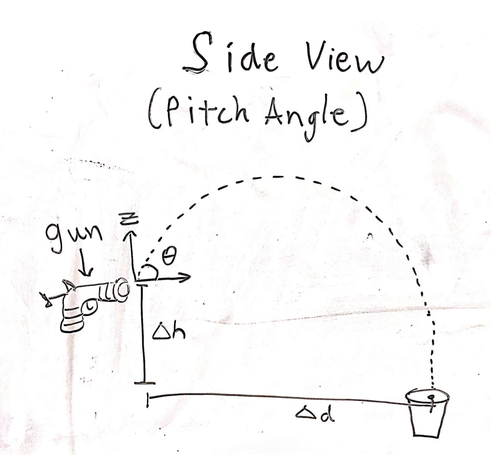

# Introduction
Our goal for this project was to allow a Baxter robot to play beer pong.
For a human with decent hand-eye coordination, this game is simple enough to play while intoxicated. However, for a Baxter robot, it's much more complicated. We can break down the game of beer pong into three main components. 

1. **Computer vision**, to recognize and locate red Solo cups on a table.
2. **Path planning**, to aim Baxter's right arm according to the best trajectory.
3. **Custom end-effector hardware**, to let Baxter "throw" a ping-pong ball with consistency and accuracy.

#### Real World Application
Besides helping you win at parties, CHAD has several useful applications in the robotics industry.
Our cup detection could be used in places such as laboratories or warehouses, where precise identification of containers and their orientation can help automate the process of moving objects from one place to another. For example, Amazon is greatly automating their fulfillment centers and relying on robots to do simple moving tasks. 
Our trajectory calculation of the ball makes use of a concept that can be applied to any weapons technology that involves projectiles. For example, a robot can determine if its current position is the best position to take a shot at a certain target, or if it should move itself to another location that allows for a better trajectory.

# Design

## Criteria
Before any implementation, we decided that we would judge the success of CHAD on these basic criteria:

- Precisely shooting the ping pong ball each turn
- Consistent recognition of cups and calculation of trajectory
- Robust end-effector hardware.

The desired functionality for CHAD is to shoot at different configurations and distances of cup targets. At a medium range, and with 6 cups in a diamond formation, we hoped to achieve a 50% cup hit rate.  We believe this percentage represents our team members’ average sober cup pong ability.

## In depth design (please include pics!!)
Vision: Akash todo
    
Hardware: Mina todo
    
Planning: mina/ayrtun todo
    
### Trajectory calculation: 
Upon receiving the coordinates of the cup, we use projectile motion equationsto find the appropriate launch angles.\
First determine the Yaw Angle (ψ)

Pitch Angle (θ)\
Given the initial velocity of the ball v_i, distance to target ∆d, and height to target ∆z, we can find the pitch angle θ.

[Link](url) and 

## Design choices and trade-offs
Our first big design choice was to go for a ping pong ball gun instead of having Baxter shoot the ball. We heeded Amay's advice that it is very difficult to simulate a throwing motion using Baxter. This makes the project more focused on vision and path planning, which is what we were more familiar with from previous lab assignments. This decision also introduced a new aspect to the design of our robot: the physics of projectile motion.

todo: Ar tag/real sense camera stuff

todo: talk about aligning the wrist with shoulder? so we only need to move two joints (maybe move this to #implementation section)

Any more?

### Effects of our design choices
- Robustness: Our vision component (akash can talk about how good chads vision is) 
- Durability: Using a plastic toy gun seemed unreliable at first, so we needed to conduct extensive test shots with the gun in order to determine how precise it is, and also calculate an initial velocity of the ping pong ball.
- Efficiency: Our design is both time and cost efficient. Our decision of using a publisher-subscriber model ensures that CHAD is always listening for target coordinates, which are transferred from the cup detection node to the baxter gripper and arm actuation nodes. CHAD's path planning improves efficieny by only ever moving two joints, the shoulder and the wrist, to aim the arm to a selected cup. The only purchases required were a set of plastic ping pong guns and ping pong balls ($10 on amazon) and red solo cups, which we already had. Other materials (zip ties, rubber bands, tape, etc.) were negligible.

# Implementation

## Hardware
todo: insert gun pic, describe attachment to baxter
## Software

### Pipeline (system diagram)

### Description of steps - shooting the ball once

# Results

[Video](https://youtu.be/NxHdCN6QJ0c)

